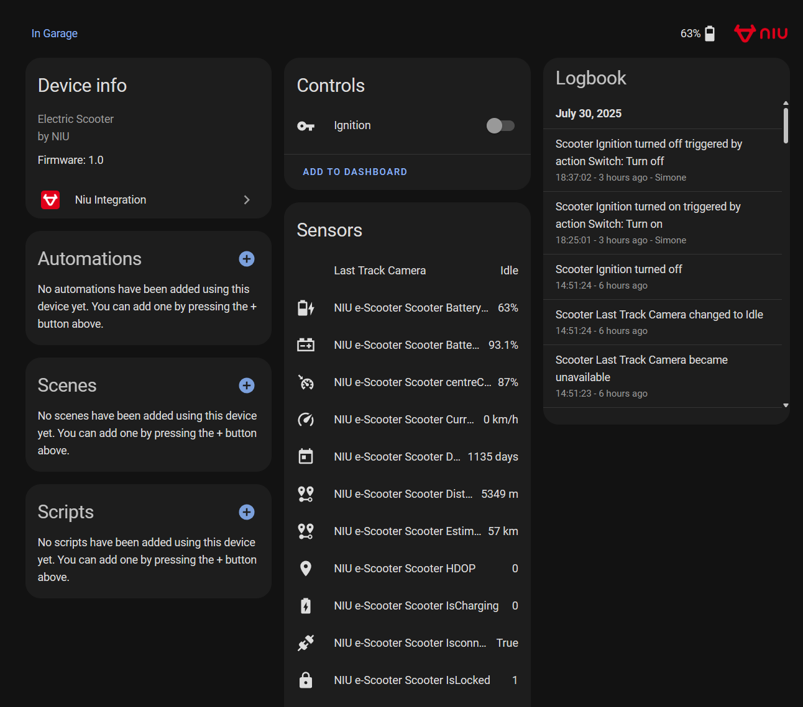
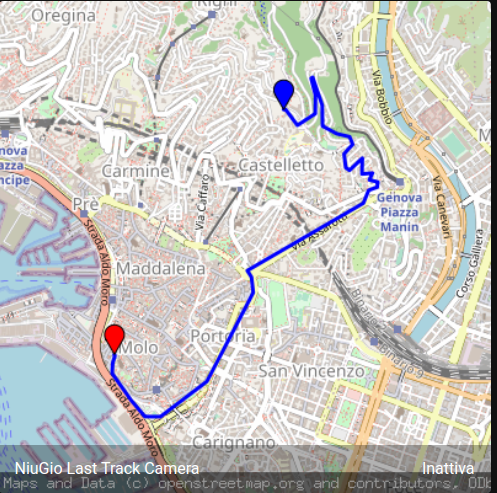
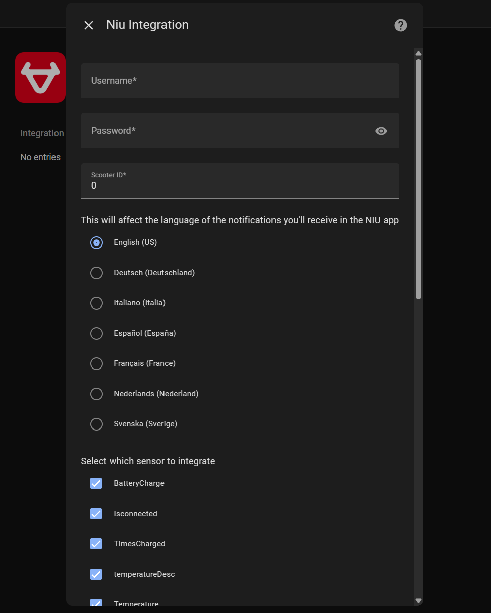

# NIU E-scooter Home Assistant integration

This is a custom component for Home Assistant to integrate your NIU Scooter.

The integration can be setup from the GUI.

## Features:

- You can select which sensors to fetch from NIU's APIs
- You can turn your scooter on and off directly from Home Assistant
- If you enable the Last Track sensor you'll get a camera entity that will show your scooter's last track

## Changes:

- The integration will now ask you to setup a language as this affects the language of the notifications that NIU will send on their mobile apps
- Instead of getting a token for each request to NIU's APIs we now store it and renew it only when it is necessary, hopefully this means we'll be able to incur less in rate limiting
- You will now be able to turn your scooter on and off directly from Home Assistant

## Some pictures:

### Device example

### Camera entity

With the thanks to pikka97 !!!

## Setup

1. In Home Assistant's settings under "Device and services" click on the "Add integration" button.
2. Search for "NIU Scooters" and click on it.
3. Insert your NIU app companion's credentials, select a language which sensors you'd like to enable.
4. Enjoy your new NIU integration :-)

## Known bugs

None but if you encounter any please let me know
